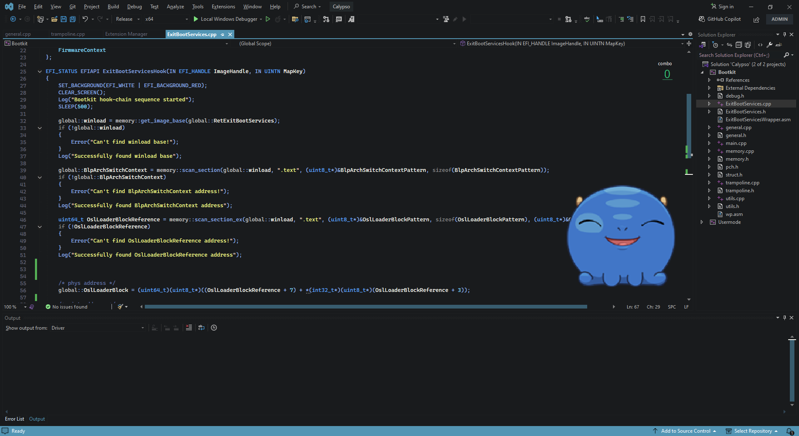
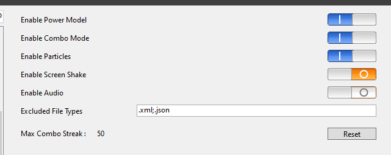
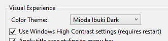
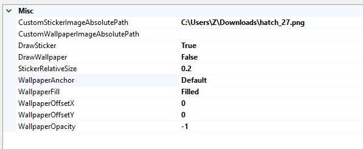

# Visual Studio

## Preview  

## Power Mode  
[PowerMode](https://marketplace.visualstudio.com/items?itemName=BigEgg.PowerMode)  

I've rebuilt this extension with some custom tweaks. If you experience lagging, consider rebuilding it with fewer particles for better performance.  

## Doki Theme  
[Doki Theme](https://marketplace.visualstudio.com/items?itemName=unthrottled.dokithemevisualstudio)  

[Custom Image](https://imgur.com/r2Jywcy)  

## Other Extensions  

- [VSColorOutput](https://marketplace.visualstudio.com/items?itemName=MikeWard-AnnArbor.VSColorOutput64)
- [FileIcons](https://marketplace.visualstudio.com/items?itemName=MadsKristensen.FileIcons) 
- [AddNewFile](https://marketplace.visualstudio.com/items?itemName=MadsKristensen.AddNewFile64)
- [CodeMaid](https://marketplace.visualstudio.com/items?itemName=SteveCadwallader.CodeMaidVS2022)
